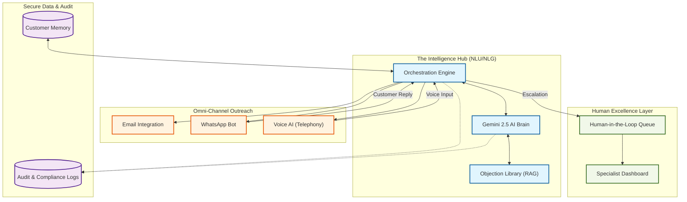

# RenewAI: Client Presentation (System Architecture)

This document provides a high-level, "Visual Block" overview of the RenewAI ecosystem, designed for client presentations and stakeholder walkthroughs.

## 🌟 Visual Architecture (System Flow)

## 🚀 Key System Components

### 1. The Intelligence Hub
*   **Gemini 2.5 Flash**: The cognitive engine that understands customer intent, tone, and sentiment.
*   **Objection Library (RAG)**: A vector-based retrieval system ensuring every response is grounded in IRDAI-compliant facts and vetted insurance templates.

### 2. Omni-Channel Engagement
*   **Elastic Communications**: The system intelligently switches between Email, WhatsApp, and Voice depending on customer responsiveness and urgency (T-45 to T+90).
*   **Voice AI**: High-fidelity, multi-lingual voice synthesis for real-time renewal calls.

### 3. Human Excellence (HIL)
*   **Bridge to Specialist**: Not a replacement, but an enhancer. AI handles 85% of routine follow-ups, escalating high-value or emotionally complex cases to human experts via a structured Dashboard.
*   **Briefing Notes**: Automatically generated summaries for human agents so they join a call with full context and "next step" recommendations.

### 4. Enterprise Compliance
*   **Audit-Ready Traces**: 100% of AI decisions are logged with their underlying rationale.
*   **PII Security**: Integrated masking logic ensures customer privacy is maintained across all logs and cloud API calls.
