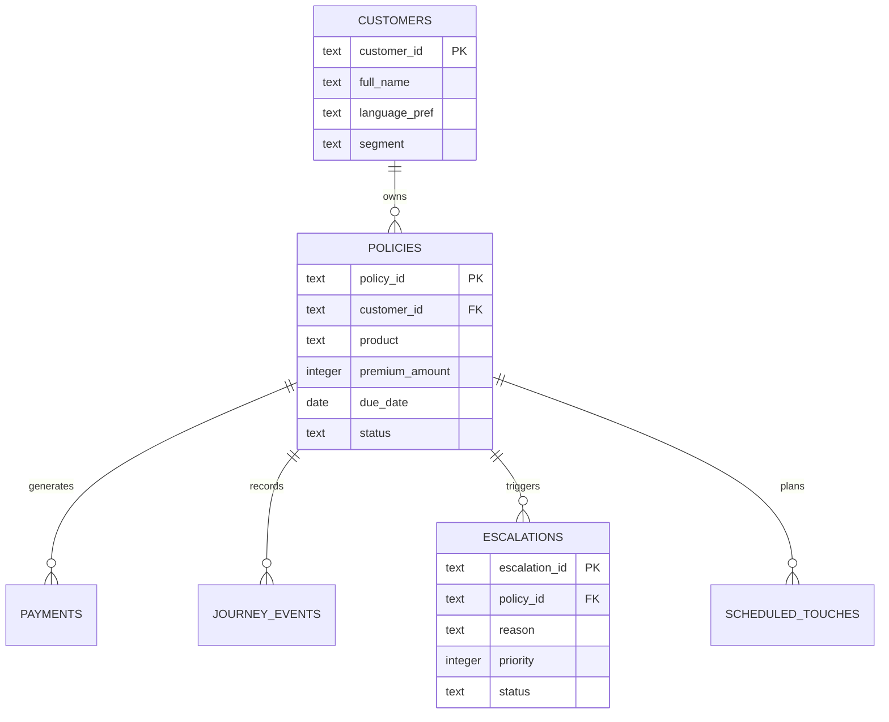

# RenewAI: Technical Design Specification

This document provides a formal technical deep-dive into the architecture, data models, and operational guardrails of the RenewAI Insurance Renewal Orchestration platform.

## 1. Architectural Patterns

### 1.1 State-Machine Driven Orchestration
The core of the system is a deterministic state machine implemented in `orchestrator.py`. Unlike traditional linear workflows, RenewAI evaluates the state of a policy (T-45 to T+90) every time an event occurs, allowing for dynamic channel switching and HIL (Human-In-The-Loop) interrupts.

### 1.3 Plan and Execute Action Framework
The system follows a decoupled "Plan and Execute" pattern for all customer outreach:
1.  **Planning**: The `RenewalOrchestrator.orchestrate()` method analyzes the current policy state and customer risk to "Plan" the next touchpoint using `plan_next_touch()`. This creates a record in the `scheduled_touches` table with a specific channel, template, and timestamp.
2.  **Execution**: A separate, asynchronous process (or API call to `/api/touches/execute`) triggers `execute_pending_touches()`. This method retrieves all "pending" records from the database and dispatches them via the assigned agents (`EmailAgent`, `WhatsAppAgent`, or `VoiceAgent`).
3.  **Autonomous Follow-ups**: The orchestrator includes conditional "Branch Logic" that automatically plans follow-up actions (e.g., "If WhatsApp not read in 24h, plan a Voice call") based on real-time event tracking.
To handle customer objections without hallucinations, RenewAI employs a RAG pattern:
- **Vector Store**: ChromaDB stores semantic embeddings of IRDAI-compliant objection-response pairs.
- **Retrieval**: Customer replies are vectorized and matched against the library in `objection_library.py`.
- **Augmentation**: The retrieved "grounded fact" is injected into the Gemini prompt to guide the final message generation.

## 2. Data Schema (Entity Relationship)

The following Mermaid diagram visualizes the SQLite schema used for customer memory and auditability.

## 3. Key API Endpoints

The `backend.py` Flask app exposes 20+ RESTful endpoints. The most critical for the automated workflow are:

| Endpoint | Method | Purpose |
| :--- | :--- | :--- |
| `/api/orchestrate` | `POST` | Triggers the state machine for a specific policy. |
| `/api/reply` | `POST` | Processes an inbound customer message (NLU + Intent). |
| `/api/touch/execute` | `POST` | Dispatches all pending scheduled outreach touches. |
| `/api/briefing/<id>`| `GET` | Generates a structured context-brief for human hand-offs. |

## 4. Security & Compliance Guardrails

As a financial services platform, RenewAI implements strict safety layers:

- **PII Masking**: The `pii_masking.py` module uses regex and entity detection to redact names, emails, and phone numbers before they are logged in the `audit_log` table.
- **Distress Detection**: The Gemini integration layer specifically classifies "DISTRESS" intents (hardship, bereavement). These trigger an immediate block on automated outreach and move the case to the `escalations` queue.
- **Audit Logs**: Every AI decision is logged with its underlying rationale in the `audit_log`, ensuring a 100% auditable trail for IRDAI regulatory review.

## 5. Deployment Topology

- **Runtime**: Python 3.10+ (Flask)
- **Database**: SQLite (WAL Mode enabled for concurrent read/write)
- **AI Models**: Google Gemini 2.5 Flash
- **Voice**: ElevenLabs API for high-fidelity speech synthesis.
