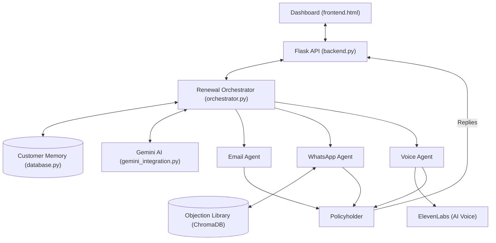
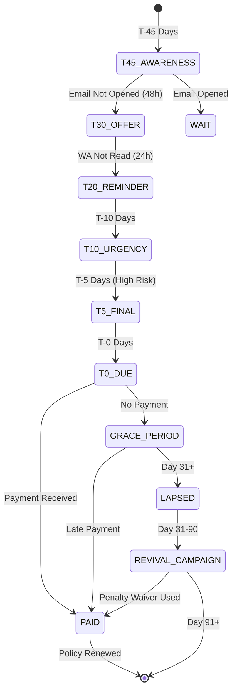
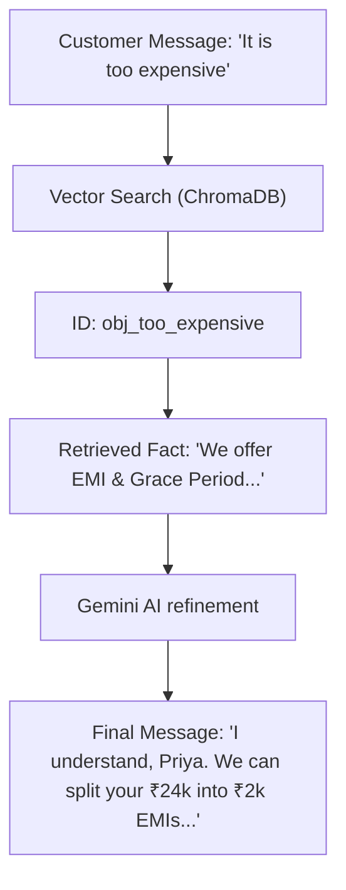

# RenewAI: Project Design Workflow

This document visualizes the core orchestration logic, system architecture, and human-in-the-loop (HIL) escalation paths for the RenewAI platform.

## 1. System Architecture Diagram
The high-level interaction between the dashboard, orchestration engine, and channel agents.



## 2. Main Orchestration Lifecycle
The state machine managing a customer's renewal journey from T-45 days to maturity or lapse.



## 3. Human-In-The-Loop (HIL) Escalation Flow
How the AI identifies and transfers complex cases to human specialists.

```mermaid
sequenceDiagram
    participant C as Customer
    participant A as Channel Agent (WA/Voice)
    participant O as Orchestrator
    participant G as Gemini AI
    participant H as Human Specialist
    
    C->>A: "I lost my job and cannot pay."
    A->>O: Forward Inbound Message
    O->>G: Classify Intent & Sentiment
    G-->>O: Intent: DISTRESS; Tone: Urgent
    O->>O: Create Escalation Table Entry (P0)
    O->>O: Generate Briefing Note
    O->>H: Notify Human Queue (HIL Interrupt)
    H->>C: Direct Calls/Negotiation
```

## 4. RAG-based Objection Handling
The retrieval mechanism for grounded, IRDAI-compliant counter-responses.



> [!NOTE]
> All automated decisions are logged in the **Audit Platform** (`database.py`) and are viewable in the **Audit Log** tab of the dashboard.
