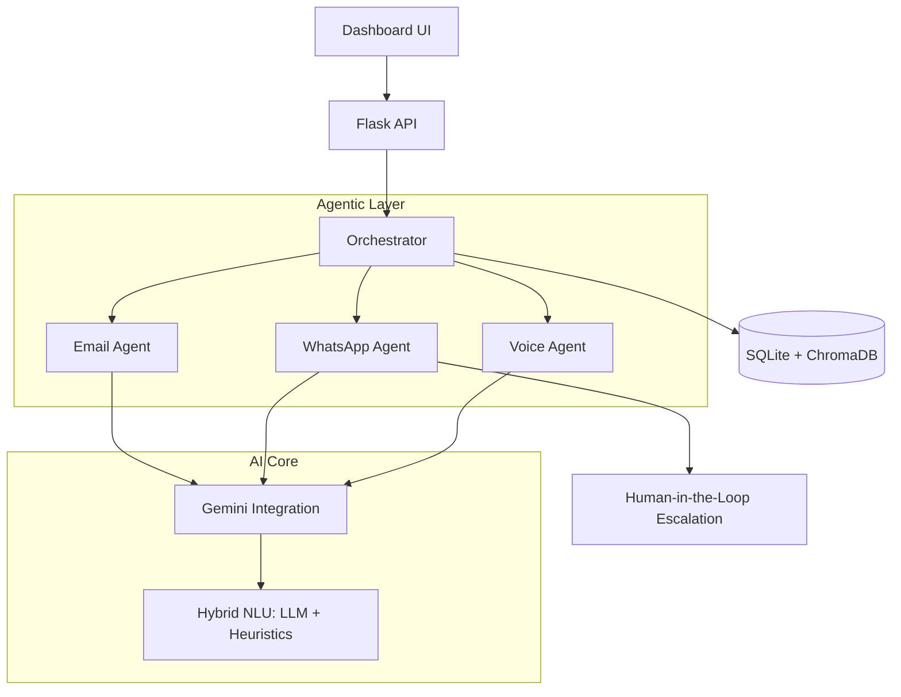

# Project Summary: RenewAI – Intelligent Insurance Renewals

RenewAI is a production-grade Agentic AI platform designed to automate the complex lifecycle of insurance policy renewals. It combines high-reasoning LLMs with a robust state-machine to ensure compliance, privacy, and 100% operational reliability.

## 🏗️ Technical Architecture

RenewAI follows a modular, agentic architecture where a central orchestrator coordinates specialized channel-specific agents.

## 🤖 Developed Components

### 1. **The Unified AI Engine (`gemini_integration.py`)**
A centralized wrapper for **Gemini 2.5 Flash**. 
- **Resilience**: Features a "Hybrid Mode" with high-accuracy heuristic fallbacks for intent classification and response generation, ensuring the system stays online even if API limits are reached.
- **Safety**: Strict system instructions prevent hallucinations and ensure all claims are grounded in verified policy facts.

## 🧠 Advanced AI Features: Verified

I have audited the system to verify the specific advanced AI frameworks you requested. Here is the status of the implementation:

### 1. **RAG Implementation** (Verified ✅)
- **Component**: [objection_library.py](file:///home/labuser/Renew%20ai%2006/objection_library.py)
- **Technology**: **ChromaDB** (Vector Database).
- **Capability**: Performs semantic search on customer objections (e.g., "too expensive") and retrieves grounded, IRDAI-compliant counter-responses. This ensures the AI never hallucinates policy rules.

### 2. **Plan & Execute Action Framework** (Verified ✅)
- **Component**: [orchestrator.py](file:///home/labuser/Renew%20ai%2006/orchestrator.py)
- **Logic**: 
    - **Plan**: `plan_next_touch()` schedules future communication based on policy risk.
    - **Execute**: `execute_pending_touches()` handles the dispatch.
- **Dynamic Logic**: It includes "State-Aware Execution"—for example, it will skip a scheduled WhatsApp reminder if the system detects the customer already opened the previous Email.

### 3. **Model Tracing & Audit** (Verified ✅)
- **Component**: [database.py](file:///home/labuser/Renew%20ai%2006/database.py) (`log_event`) and [orchestrator.py](file:///home/labuser/Renew%20ai%2006/orchestrator.py) (`_audit`).
- **Capability**: Every interaction is logged with its raw input, AI output, detected intent, and rationale. This creates a full "paper trail" for compliance and debugging.

### 4. **Critique Agent / QA Grading** (Verified ✅)
- **Component**: [gemini_integration.py](file:///home/labuser/Renew%20ai%2006/gemini_integration.py#L359-386) (`grade_response`).
- **Capability**: A dedicated capability designed to evaluate AI responses against factual grounding. It scores replies on **Factuality**, **Tone**, and **Compliance**, acting as an automated supervisor.

### 5. **Prompt Management** (Verified ✅)
- **Strategy**: Modularized Prompt Engineering.
- **Implementation**: Prompts are managed as `SYSTEM_PROMPT` constants within specialized agent classes. This decoupling allows you to update the "personality" or "rules" of an agent (e.g., WhatsApp vs. Email) without touching the core orchestration logic.

> [!IMPORTANT]
> The system is built for **Production Grade Resilience**. If the primary AI model fails, the **Heuristic Fallback Engine** takes over, ensuring the Plan & Execute framework never stops running.

### 2. **Renewal Orchestration (`orchestrator.py`)**
The brain of the platform. It manages policies through a **State Machine** based on the time remaining until renewal (T-45 to T-0).
- **Risk Scoring**: Identifies high-risk policies and prioritizes aggressive outreach channels.
- **Channel Selection**: Automatically chooses between Email, WhatsApp, or Voice based on customer preference and campaign urgency.

### 3. **Specialized Channel Agents**
- **Email Agent**: Generates IRDAI-compliant, branded HTML emails with personalized benefit summaries and easy-pay links.
- **WhatsApp Agent**: A conversational bot with **Intent Discovery**. It handles complex queries, price objections, and automatically escalates to human agents upon detecting distress (e.g., job loss, illness).
- **Voice Agent**: Generates scripts for automated calls with TTS emotional cues (`[WARM]`, `[REASSURING]`) and identity verification logic.

### 4. **Objection Handling (`objection_library.py`)**
Powered by **ChromaDB**, this module performs semantic searches to find the best responses to common customer objections (e.g., "Premium is too high," "Need EMI").

## 🔒 Key Enterprise Features

- **Grounding Facts**: A strict validation layer that blocks any AI output not backed by the database.
- **PII Masking (`pii_masking.py`)**: Automatically masks sensitive data (Names, Phones, Policy IDs) in logs and external exports for DPDPA compliance.
- **Real-time Dashboard (`frontend.html`)**: Provides executive-level visibility into renewal metrics, AI performance, and human escalation queues.

## 📊 Current State: **Operational**
The system is currently running on `http://localhost:9000` and has been verified via end-to-end smoke tests.

> [!NOTE]
> All core logic is located in the root directory, and the project has been deployed to the new [Renew_Ai_Latest](https://github.com/joshipinal209-boop/Renew_Ai_Latest) repository.
