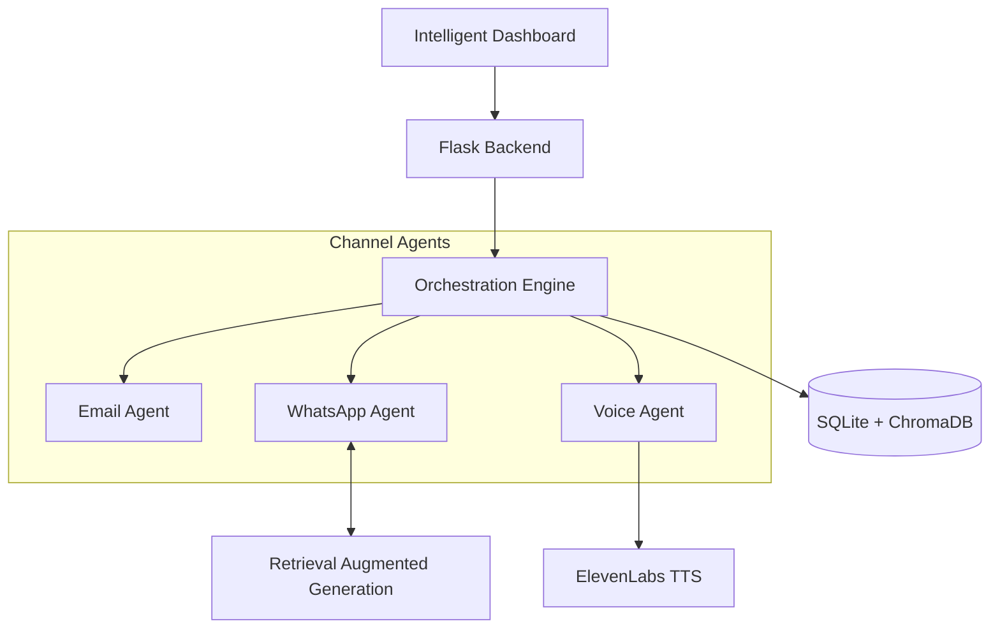

# RenewAI: Intelligent Insurance Renewal Orchestration

RenewAI is a production-ready **Agentic AI Platform** designed to automate the end-to-end insurance renewal lifecycle. It leverages high-reasoning LLMs, a robust state-machine, and specialized channel agents to drive conversion while ensuring 100% regulatory compliance.

---

## 🚀 Key Features

- **Agentic Orchestration**: A central engine (`orchestrator.py`) that manages policies from T-45 awareness to revival.
- **Multi-Channel Delivery**: Specialized AI agents for **Email**, **WhatsApp**, and **Voice** (via ElevenLabs).
- **RAG-Powered Objection Handling**: Uses **ChromaDB** to retrieve grounded, IRDAI-compliant responses to customer concerns.
- **Hybrid NLU Resilience**: An autonomous fallback engine that ensures system uptime even if LLM APIs are unavailable.
- **Human-in-the-Loop (HIL)**: Intelligent distress detection that automatically escalates complex cases to human specialists.
- **Compliance First**: Built-in **PII Masking** and strict data grounding to prevent hallucinations.

## 🏗️ Technical Architecture



## 🛠️ Quick Start

### 1. Installation
```bash
pip install -r requirements.txt
```

### 2. Environment Setup
Create a `.env` file with your credentials:
```env
GOOGLE_API_KEY=your_gemini_key
ELEVENLABS_API_KEY=your_key
BASE_URL=http://localhost:9000
```

### 3. Run the Platform
```bash
# Start the backend server
python backend.py
```

### 4. Access the Dashboard
Open `frontend.html` in your browser to view real-time metrics, policy statuses, and the AI audit log.

## 📂 Project Structure

- `orchestrator.py`: The core state-machine and decision engine.
- `gemini_integration.py`: Centralized AI logic with hybrid fallback.
- `whatsapp_agent.py`: Conversational AI for WhatsApp interactions.
- `objection_library.py`: ChromaDB implementation for RAG.
- `pii_masking.py`: Security utility for data protection.

## 📖 In-Depth Documentation

- [**Design Workflow**](DESIGN_WORKFLOW.md): Detailed Mermaid diagrams of all core processes.
- [**Project Summary**](PROJECT_SUMMARY.md): Comprehensive verification of advanced AI features.

---
*Developed for Suraksha Life Insurance Co. Ltd. by the RenewAI Team.*
